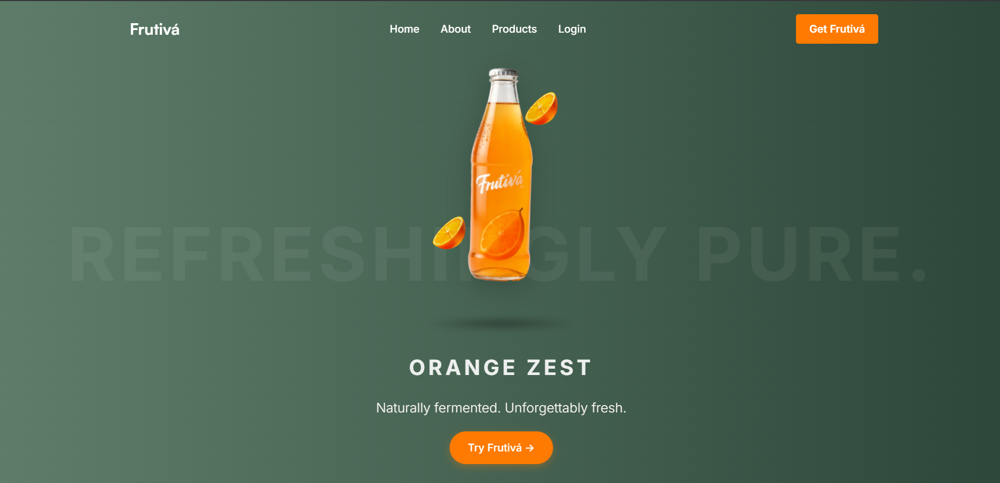

# 🧃 Frutivá – Premium Fermented Juice Brand Website

**Tagline:** _Naturally fermented. Unforgettably fresh._

Frutivá is a **premium fermented juice brand** website showcasing naturally fermented, probiotic-rich beverages. This is a modern, responsive React-based web application emphasizing smooth animations, premium design, and an exceptional user experience.

**🔗 Live Demo:** [https://frutiva.netlify.app](https://frutiva.netlify.app)


---


## 📸 Screenshots

| 🧃 Hero Section | 📖 Brand Story | 🍊 Why Frutivá |
|----------------|----------------|----------------|
|  |  |  |

---


## ✨ Features

### 🏠 Landing Page (Hero Section)
- 🔄 **Rotating Product Showcase** (Auto cycle of 4 signature flavors):
  - Orange Zest
  - Berry Bloom
  - Mint Splash
  - Cool Grape
- 🎥 Smooth Framer Motion animations
- 🍊 Interactive bottle rotation and floating fruit particles
- 🌐 Fully responsive design (mobile-first)
- 💎 Glass-morphism with green gradient background (`#5E7D69 → #2D473A`)

### 📖 Brand Story Section
- 📜 Compelling story: Journey from kitchen experiment to premium brand
- 🌠 Parallax scrolling with floating elements
- 🧊 Glass card design with backdrop-blur
- 🔬 Fermentation process explained step-by-step
- 💪 Health benefits & nutritional information
- 🧱 Responsive grid layout

### 🧭 Navigation
- 📌 Fixed transparent navbar
- 📱 Mobile hamburger menu
- 🎨 Consistent orange accent branding (`#FF7A00`)

---

## 🛠️ Tech Stack

- **Frontend Framework:** React 18+
- **Animations:** Framer Motion
- **Styling:** CSS3 + Custom Properties
- **Icons:** Lucide React + Custom SVGs
- **Typography:** Poppins, Inter, Satoshi
- **Layout:** Mobile-first, Flexbox, CSS Grid

---

## 🎨 Design Philosophy

- 🍏 Inspired by Apple-style product displays
- 🌿 Natural color palette reflecting freshness
- ⚡ 60fps animations with micro-interactions
- ♿ Accessibility: High contrast and semantic HTML
- 🚀 Optimized for performance and lazy loading

---

## 🚀 Getting Started

```bash
# Clone the repository
git clone https://github.com/Syedzayed/Frutiva.git

# Navigate into the directory
cd Frutiva

# Install dependencies
npm install

# Start the development server
npm start

# Build for production
npm run build
